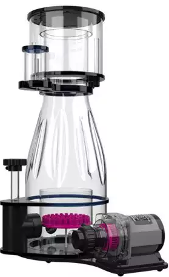

# Aquamedic
> Part of the [**ReefTech Project Ecosystem**](https://elwinmage.github.io/reeftank/)
<p align="center">
  
</p>

[](https://github.com/hacs/hacs)
[](https://developers.home-assistant.io/docs/architecture_index/#branding)
[](https://github.com/Elwinmage/ha-aquamedic-component/releases)

[](https://github.com/Elwinmage/ha-aquamedic-component/actions/workflows/main.yml)
[](https://github.com/Elwinmage/ha-aquamedic-component/actions/workflows/hass_and_hacs.yml)
[](https://app.codecov.io/gh/Elwinmage/ha-aquamedic-component)
[](https://github.com/Elwinmage/ha-aquamedic-component)

# Supported Languages: [](https://github.com/Elwinmage/ha-aquamedic-component/blob/main/README.md) [](https://github.com/Elwinmage/ha-aquamedic-component/blob/main/doc/fr/README.fr.md) [](https://github.com/Elwinmage/ha-aquamedic-component/blob/main/doc/de/README.de.md) [](https://github.com/Elwinmage/ha-aquamedic-component/blob/main/doc/es/README.es.md) [](https://github.com/Elwinmage/ha-aquamedic-component/blob/main/doc/it/README.it.md) [](https://github.com/Elwinmage/ha-aquamedic-component/blob/main/doc/pl/README.pl.md) [](https://github.com/Elwinmage/ha-aquamedic-component/blob/main/doc/pt/README.pt.md)

Control your Aqua Medic pumps from Home Assistant via the Gizwits cloud API.

---

## Supported Devices

Your device is not supported? Please contact me.

> ✅ Supported &nbsp;|&nbsp; 🧪 Untested (may work) &nbsp;|&nbsp; ❌ Not yet supported

| Device | | Internal Name | Product Key | Status |
|---|---|---|---|---|
| Aqua Medic EcoDrift / SmartDrift x.1 / x.3 |  | `Current_Pump` | `63632f4902094055ab3fd994c0d612fa` | ✅ |
| Aqua Medic DC Runner series — return pump |  | `DC_Runner` | `00276aa006684c05805c297f60058c3d` | ✅ |
| Aqua Medic DC Runner series — skimmer pump |  | `DC_Runner` | `00276aa006684c05805c297f60058c3d` | ✅ |
| Aqua Medic DC Runner (legacy / speculative) | | `DC_Runner` | `8879684725d14066922374e50889f893` | 🧪 |
| Aqua Medic Reefdoser EVO | | `Dosing_Pump` | `a1f9488390b4458f9676677f51664324` | ❌ |
| Aqua Medic T-Controller Twin | | `Temp_Ctrl` | `f6a8e5d2c1b04a9e8d7c6b5a4f3e2d1c` | ❌ |
| Aqua Medic Aquarius / Spectrus | | `Light_Ctrl` | `7d2e9b8a1c3f4e5d6a7b8c9d0e1f2a3b` | ❌ |

> The DC Runner **return pump** and **skimmer pump** share the same firmware and Gizwits product key. They expose an identical datapoint set (verified against two independent real-device captures) and are handled by the same code path — the two rows above are the same device with different pump heads. In Home Assistant they both appear as model *DC Runner*; use the device alias to distinguish which pump is which.
>
> The `8879684725…` product key is a speculative simpler variant that has not (yet) been observed on real hardware; the code path is kept in place in case a device advertising this key shows up.

All these devices use the Gizwits IoT platform (same backend as the official Aqua Medic app). Support for additional devices may be added in future releases.

---

## Installation

### Via HACS

The integration is now officially in HACS. Simply search for **Aqua Medic** in the Integrations tab and install it.

Or use the direct installation button:

[](https://my.home-assistant.io/redirect/hacs_repository/?owner=Elwinmage&repository=ha-aquamedic-component&category=integration)

Then restart Home Assistant.

---

## Entities

### EcoDrift / SmartDrift

#### Switches

| Entity | Description |
|---|---|
| **Power** | Main on/off |
| **Wave type** | Pulse mode (off) / Tide mode (on) |
| **Feeding mode** | Activates feeding pause |
| **Timer** | Enables program mode |
| **0-10V control mode** | When on, disables the Flow rate slider (pump driven by external 0-10V signal) |

#### Selects

| Entity | Options |
|---|---|
| **Wave mode** | Classic wave · Sine wave · Random wave · Constant flow |
| **Linkage** | Independent · Master · Slave |

#### Numbers

| Entity | Range | Description |
|---|---|---|
| **Flow rate** | 0–100 % | Motor flow (disabled in 0-10V mode) |
| **Frequency** | 0–100 % | Wave frequency |
| **Feeding duration** | 1–60 min | Duration of feeding pause |

#### Binary Sensors (diagnostic)

| Entity | Description |
|---|---|
| **Overcurrent fault** | Motor overcurrent / short circuit |
| **Overvoltage fault** | Motor overvoltage |
| **Overtemperature fault** | Motor temperature too high |
| **Undervoltage fault** | Motor undervoltage |
| **Locked rotor fault** | Motor jammed / blocked |
| **No load fault** | Pump running dry |
| **UART communication fault** | Module ↔ mainboard communication error |

#### Button (diagnostic)

| Entity | Description |
|---|---|
| **Refresh** | Forces an immediate data refresh without waiting for the next poll interval |

### DC Runner series (return pump *and* skimmer pump)

> ✅ Confirmed against two real device captures (return pump + skimmer). The two variants share the same firmware — Home Assistant displays them both as model *DC Runner*; the exact pump role (return / skimmer) is only distinguishable from your device alias.

> A legacy simpler variant with product key `8879684725…` (single `Flow` control, no scheduler) is also handled by the integration but has not been confirmed on real hardware.

#### Switches

| Entity | Description |
|---|---|
| **Power** | Main on/off |
| **Feeding mode** | Activates feeding pause |
| **Timer** | Enables the timer / schedule program |
| **0-10V control mode** | When on, disables the speed slider (pump driven by external 0-10V signal) |

#### Selects

| Entity | Options |
|---|---|
| **Timer mode** | Stop · Auto · Feeding |

#### Numbers

| Entity | Range | Description |
|---|---|---|
| **Motor speed** | 30–100 % | Pump speed (minimum 30 % — below this the motor may stall; disabled in 0-10V mode) |
| **Feeding duration** | 1–60 min | Duration of the feeding pause |
| **Timer speed** | 0–100 % | Speed used by the scheduled program |
| **Timer feeding time** | 1–60 min | Feeding duration used by the scheduled program |

#### Binary Sensors (diagnostic)

| Entity | Description |
|---|---|
| **Overcurrent fault** | Motor overcurrent / short circuit |
| **Overvoltage fault** | Motor overvoltage |
| **Overtemperature fault** | Motor temperature too high |
| **Undervoltage fault** | Motor undervoltage |
| **Locked rotor fault** | Motor jammed / blocked |
| **No load fault** | Pump running dry |
| **UART communication fault** | Module ↔ mainboard communication error |

#### Button (diagnostic)

| Entity | Description |
|---|---|
| **Refresh** | Forces an immediate data refresh |

> **About 0-10V control:** every DC Runner controller has a physical 0-10V input for an external aquarium controller (Apex, GHL, …). It is a hardware port, not a cloud value, so it does not appear as a device attribute — the *0-10V control mode* switch is a local Home Assistant flag that disables the speed slider while the pump is driven externally. Per Aqua Medic's manual, in 0-10V mode the pump must run at **≥ 60 %**.

---

<!-- maintenance-section:start -->

## Maintenance

The integration tracks the cleaning and wear tasks of each pump. Every task comes with three entities: a **button** to record that the job is done, a **slider** to adjust the interval, and a **switch** to mute its alerts. Nothing is sent to the cloud — the state is stored locally, per config entry.

The DC Runner return pump and the DC Skimmer share the same firmware and the same Gizwits product key, so the API cannot tell them apart. Declare it once with the **Pump role** select: the task list follows (the integration reloads itself to apply it). As long as the role is *Not set*, a DC Runner carries no maintenance task. EcoDrift / SmartDrift pumps never ask.

| Pump | Task | Default | Range |
|---|---|---|---|
| EcoDrift / SmartDrift | Clean impeller and filter basket | 2 | 1–3 |
| EcoDrift / SmartDrift | Descale pump | 6 | 3–9 |
| EcoDrift / SmartDrift | Replace impeller and bearings | 18 | 12–24 |
| DC Runner (return) | Clean suction strainer | 6 w | 3–9 w |
| DC Runner (return) | Clean impeller and pump chamber | 4 | 2–6 |
| DC Runner (return) | Replace impeller and bearings | 18 | 12–24 |
| DC Runner (skimmer) | Clean collection cup | 2 w | 1–4 w |
| DC Runner (skimmer) | Clean venturi and air line | 4 w | 2–8 w |
| DC Runner (skimmer) | Clean needle wheel | 2 | 1–4 |
| DC Runner (skimmer) | Descale skimmer body | 6 | 3–12 |
| DC Runner (skimmer) | Replace needle wheel and bearings | 18 | 12–24 |

> Values in months unless followed by `w` (weeks). Aqua Medic publishes no numeric interval, so these defaults come from reef keeping practice — every one of them is adjustable per pump.

### Notifications

The integration never notifies by itself, on purpose. The **Aqua Medic watch** blueprint shipped with the repository does it, and also covers hardware faults and offline pumps. Click the button below and confirm the import in Home Assistant:

[](https://my.home-assistant.io/redirect/blueprint_import/?blueprint_url=https%3A%2F%2Fgithub.com%2FElwinmage%2Fha-aquamedic-component%2Fblob%2Fmain%2Fblueprints%2Fautomation%2Faquamedic_alerts.en.yaml)

A French version is available as [`aquamedic_alerts.fr.yaml`](https://github.com/Elwinmage/ha-aquamedic-component/blob/main/blueprints/automation/aquamedic_alerts.fr.yaml).

Tasks are also picked up by the maintenance view of [ha-reef-card](https://github.com/Elwinmage/ha-reef-card), next to the Red Sea ones: both integrations publish the same `reef_role` entity contract.

<!-- maintenance-section:end -->

## Configuration

Go to **Settings → Devices & Services → Add Integration → Aqua Medic**.

| Field | Description |
|---|---|
| **E-mail** | Your Aqua Medic app account e-mail |
| **Password** | Your Aqua Medic app password |
| **Gizwits server** | Region server — select **Europe** for EU users |
| **Refresh interval** | How often device state is polled (5–300 s, default 30 s) |

The correct server is pre-selected automatically based on your Home Assistant language.

After setup, options (refresh interval) can be changed via **Settings → Devices & Services → Aqua Medic → Configure**.

---

## Development

### Local simulator

A Gizwits cloud simulator (`scripts/gizwits_simulator.py`) lets you test the integration without real hardware or cloud access. It is configured via `scripts/gizwits_sim_config.json`:

| Key | Description |
|---|---|
| `username` / `password` | Credentials the integration must use to log in |
| `virtual_ip` | IP the simulator binds to (`127.0.0.1` skips virtual-IP setup) |
| `interface` | Network interface for the virtual IP (optional; if omitted, the default-route interface is auto-detected, falling back to `eth0`; can be overridden with `-i/--interface`) |
| `port` | Listening port (default `8080`) |
| `devices` | List of `{ "type": ..., "count": N }`; available types: `smartdrift`, `dc_runner` (legacy speculative variant), `dc_runner_return` (DC Runner series return pump), `dc_skimmer` (DC Runner series skimmer pump — same firmware as `dc_runner_return`) |

Run it with `sudo python3 scripts/gizwits_simulator.py` (root is required to add the virtual IP).

To make the **Simulator** region appear in the config flow, create the local flag file (git-ignored, never commit it):

```bash
cp custom_components/aquamedic/simulator_enabled.example custom_components/aquamedic/.simulator_enabled
```

Restart Home Assistant, add the integration and select *Simulator*; you will then be asked for the simulator host URL (default `http://localhost:8080`) and the credentials from the config file.

---

## License

MIT – see [LICENSE](LICENSE).

***

[buymecoffee]: https://paypal.me/Elwinmage
[buymecoffeebadge]: https://img.shields.io/badge/buy%20me%20a%20coffee-donate-yellow.svg?style=flat-square
[ruff-shield]: https://github.com/Elwinmage/ha-aquamedic-component/actions/workflows/ruff.yml/badge.svg
[ruff-link]: https://github.com/Elwinmage/ha-aquamedic-component/actions/workflows/ruff.yml
[pyright-shield]: https://github.com/Elwinmage/ha-aquamedic-component/actions/workflows/pyright.yml/badge.svg
[pyright-link]: https://github.com/Elwinmage/ha-aquamedic-component/actions/workflows/pyright.yml
[coverage-shield]: https://raw.githubusercontent.com/Elwinmage/ha-aquamedic-component/main/badges/coverage.svg
[coverage-link]: https://app.codecov.io/gh/Elwinmage/ha-aquamedic-component
