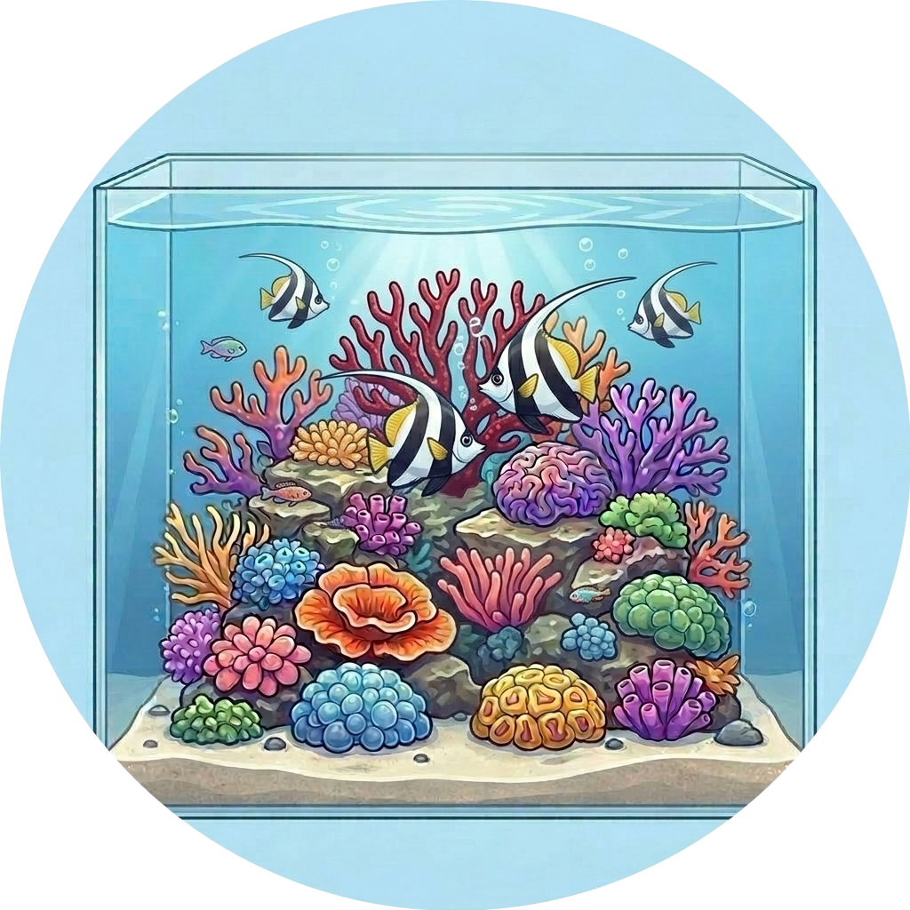

# Aquamedic

  

# Supported Languages:       

Contrôlez vos pompes de brassage Aqua Medic depuis Home Assistant via l'API cloud Gizwits.

---

## Appareils compatibles

Votre appareil n'est pas supporté ? Contactez-moi.

| Appareil | Nom interne | Clé produit | Supporté |
|---|---|---|---|
| Aqua Medic EcoDrift / SmartDrift x.1 / x.3 | `Current_Pump` | `63632f4902094055ab3fd994c0d612fa` | ✅ |
| Aqua Medic DC Runner (pompe de remontée) | `DC_Runner` | `8879684725d14066922374e50889f893` | ❌ |
| Aqua Medic Reefdoser EVO | `Dosing_Pump` | `a1f9488390b4458f9676677f51664324` | ❌ |
| Aqua Medic T-Controller Twin | `Temp_Ctrl` | `f6a8e5d2c1b04a9e8d7c6b5a4f3e2d1c` | ❌ |
| Aqua Medic Aquarius / Spectrus | `Light_Ctrl` | `7d2e9b8a1c3f4e5d6a7b8c9d0e1f2a3b` | ❌ |

Tous ces appareils utilisent la plateforme IoT Gizwits (même backend que l'application officielle Aqua Medic). La prise en charge d'appareils supplémentaires pourra être ajoutée dans de futures versions.

---

## Entités

Chaque appareil SmartDrift / EcoDrift expose les entités suivantes dans Home Assistant.

### Interrupteurs

| Entité | Description |
|---|---|
| **Alimentation** | Marche/arrêt principal |
| **Type de vague** | Mode impulsion (off) / Mode marée (on) |
| **Mode nourrissage** | Active la pause de nourrissage |
| **Minuterie** | Active le mode programme |
| **Mode contrôle 0-10V** | Quand activé, désactive le curseur de débit (la pompe est pilotée par un signal externe 0-10V) |

### Listes de sélection

| Entité | Options |
|---|---|
| **Mode vague** | Vague classique · Vague sinusoïdale · Vague aléatoire · Débit constant |
| **Couplage** | Indépendant · Maître · Esclave |

### Nombres

| Entité | Plage | Description |
|---|---|---|
| **Débit** | 0–100 % | Débit moteur (désactivé en mode 0-10V) |
| **Fréquence** | 0–100 % | Fréquence des vagues |
| **Durée de nourrissage** | 1–60 min | Durée de la pause de nourrissage |

### Capteurs binaires (diagnostic)

| Entité | Description |
|---|---|
| **Défaut surintensité** | Surintensité / court-circuit moteur |
| **Défaut surtension** | Surtension moteur |
| **Défaut surchauffe** | Température moteur trop élevée |
| **Défaut sous-tension** | Sous-tension moteur |
| **Défaut rotor bloqué** | Moteur grippé / bloqué |
| **Défaut marche à vide** | Pompe fonctionnant à sec |
| **Défaut communication UART** | Erreur de communication module ↔ carte principale |

### Bouton (diagnostic)

| Entité | Description |
|---|---|
| **Actualiser** | Force une actualisation immédiate sans attendre le prochain cycle d'interrogation |

---

## Installation

### Via HACS (recommandé)

1. Dans HACS, aller dans **Intégrations → ⋮ → Dépôts personnalisés**
2. Ajouter `https://github.com/Elwinmage/ha-aquamedic-component` en tant qu'**Intégration**
3. Rechercher **Aqua Medic** et installer
4. Redémarrer Home Assistant

---

## Configuration

Aller dans **Paramètres → Appareils et services → Ajouter une intégration → Aqua Medic**.

| Champ | Description |
|---|---|
| **E-mail** | Adresse e-mail de votre compte Aqua Medic |
| **Mot de passe** | Mot de passe de votre compte Aqua Medic |
| **Serveur Gizwits** | Serveur régional — sélectionner **Europe** pour les utilisateurs EU |
| **Intervalle d'actualisation** | Fréquence d'interrogation de l'appareil (5–300 s, défaut 30 s) |

Le serveur correct est présélectionné automatiquement en fonction de la langue de Home Assistant.

Après configuration, l'intervalle d'actualisation peut être modifié via **Paramètres → Appareils et services → Aqua Medic → Configurer**.

---

## Licence

MIT – voir [LICENSE](../../LICENSE).
